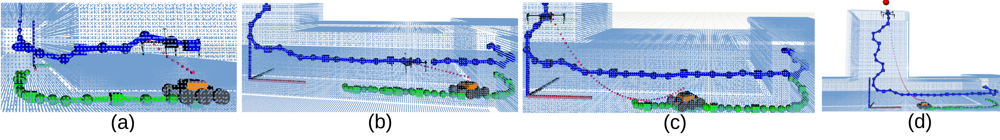

# rrt_star_planners

This package implements a RRT Star Planner adapted to get path for a tied marsupial robotic configuration, in which a UGV is linked to a UAV platform by means of a cable.

In our implementation, this cable is not necessary tight. In contrast, we assume that there is a device that can modify the length of the tether on demand. When generating new candidate points, we check for collision on both the UGV, the UAV and the tether. We iteratively look for a valid tether length that is collision-free. 

When expanding the tree, we check also for intermediate configurations in all the three subsystems. See the following figure as an example.

For more details, please refer to our paper:

["Path and trajectory planning of a tethered UAV-UGV marsupial robotic system"
S. Martínez-Rozas, D. Alejo, F. Caballero, L. Merino](https://arxiv.org/abs/2204.01828)

## Installation

Please refer to the metapackage .... for detailed installation instructions of the whole system

## Usage

In order to reproduce the tests presented in the paper, we provide you with a convenient lauchner for configuring the system. Then, the planner can be called on demand. You have to run the following commands in two separate terminals:

    roslaunch rrt_planners random_planner_marsupial.launch map:=stage_2
    roscd marsupial_optimizer/trees/script/ && ./execute_tree.sh stage_2

## Acknowledgement

This work is partially supported by Programa Operativo FEDER Andalucia 2014-2020, Consejeria de Economía, Conocimiento y Universidades (DeepBot, PY20_00817) and by the Spanish Ministry of Science, Innovation and Universities (Insertion PID2021-127648OB-C31, MCIU/AEI/FEDER, UE).

 
